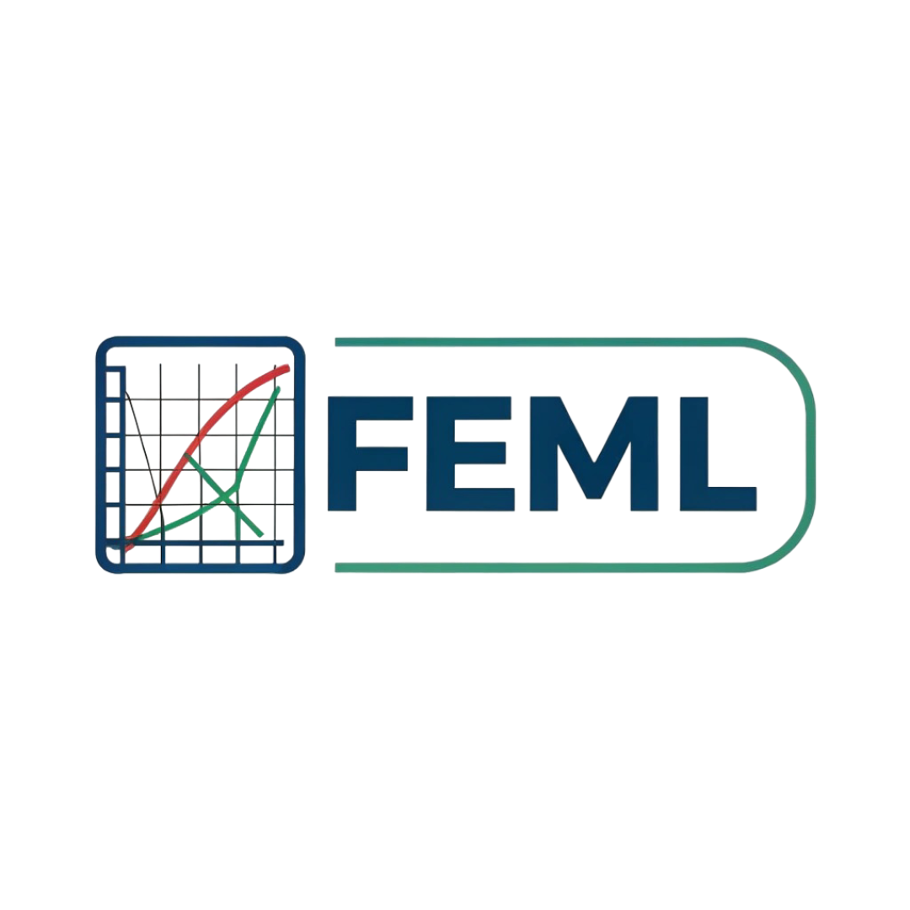

<a id="readme-top"></a>

<!-- [![Contributors][contributors-shield]][contributors-url]
[![Forks][forks-shield]][forks-url]
[![Stargazers][stars-shield]][stars-url]
[![Issues][issues-shield]][issues-url] -->
[![Unlicense License][license-shield]][license-url]
[![LinkedIn][linkedin-shield]][linkedin-url]
[![LinkedIn][linkedin-shield]][linkedin-url2]


<!-- PROJECT LOGO -->
<br />
<div align="center">
  <a href="https://github.com/Bsprogrammer28/FEML">
    
  </a>

  <h3 align="center">FEML - Finit Element Machine Learning</h3>

  <p align="center">
    Combining FEM and ML for the best of both worlds!!!
    <br />
    <!--<a href=""><strong>Explore the docs »</strong></a>-->
    <br />
    <br />
    <!--<a href="">View Demo</a> 
    &middot; -->
    <a href="https://github.com/Bsprogrammer28/FEML/issues/new">Report Bug</a>
    &middot;
    <a href="https://github.com/Bsprogrammer28/FEML/issues/new">Request Feature</a>
  </p>
</div>


<!-- TABLE OF CONTENTS -->
<details>
  <summary>Table of Contents</summary>
  <ol>
    <li>
      <a href="#about-the-project">About The Project</a>
      <ul>
        <li><a href="#built-with">Built With</a></li>
      </ul>
    </li>
    <li>
      <a href="#getting-started">Getting Started</a>
      <ul>
        <li><a href="#prerequisites">Prerequisites</a></li>
        <li><a href="#installation">Installation</a></li>
      </ul>
    </li>
    <li><a href="#usage">Usage</a></li>
    <!-- <li><a href="#roadmap">Roadmap</a></li> -->
    <li><a href="#contributing">Contributing</a></li>
    <li><a href="#license">License</a></li>
    <li><a href="#contact">Contact</a></li>
    <li><a href="#acknowledgments">Acknowledgments</a></li>
  </ol>
</details>


<!-- ABOUT THE PROJECT -->
## About The Project

<!-- [![Product Name Screen Shot][product-screenshot]](https://example.com) -->

FEML is a Python-based framework that combines **Finite Element Method (FEM)** concepts with **Machine Learning (ML)** techniques.  
The goal of this project is to build, train, validate, and visualize physics-informed and data-driven models for structural mechanics problems such as **3D beam analysis**.

This repository is designed to be modular, extensible, and suitable for experimentation with FEM + ML / PINN-style workflows.

<p align="right">(<a href="#readme-top">back to top</a>)</p>


### Built With

This section should list any major frameworks/libraries used to bootstrap your project. Leave any add-ons/plugins for the acknowledgements section. Here are a few examples.

* [![Python][Python]][Python-url]
* [![Pytorch][Pytorch]][Pytorch-url]
* [![PyQt5][PyQt5]][PyQt5-url]

<p align="right">(<a href="#readme-top">back to top</a>)</p>


<!-- GETTING STARTED -->
## Getting Started

### Prerequisites

Before working with this project, make sure you have:

- Python **3.9 or higher**
- Git

### Installation

<!-- 1. Get a free API Key at [https://example.com](https://example.com) -->
1. Clone the repo
   ```sh
   git clone https://github.com/Bsprogrammer28/FEML.git
   cd FEML
   ```
2. Create a Virtual Environment (Recommended)
   Windows
   ```sh
   python -m venv venv
   venv/Scripts/activate
   ```
   Linux/ macOS
   ```sh
   python3 -m venv venv
   source venv/bin/activate
   ```
3. Install Dependencies
   ```sh
   pip install -r requirements.txt
   ```
4. Run the main file
   ```sh
   python main.py
   ```

<p align="right">(<a href="#readme-top">back to top</a>)</p>

## Usage
![Application Image][App]
**Currently the application is in early stage so most of the buttons are not functional


**Geometry**


You can change the geometry of the beam using the geometry dock


![Geometry][Geo]


**Loading Conditions**


You can setup your loading conditions such as position and magnitude of the force applied to the beam


![Loading Conditions][LC]


**Visuals**


After setting it up you can see the visuals for the **Boundary Conditions** and **Loading Conditions** in the preview


![Visuals][Visual]


**Results**


Once you press on solve the model will predict for the deformation and give you the contour for the following


![Results][Results]


![Contours][Contour]
<p align="right">(<a href="#readme-top">back to top</a>)</p>


<!-- ROADMAP
## Roadmap

- [x] Add Changelog
- [x] Add back to top links
- [ ] Add Additional Templates w/ Examples
- [ ] Add "components" document to easily copy & paste sections of the readme
- [ ] Multi-language Support
    - [ ] Chinese
    - [ ] Spanish

See the [open issues](https://github.com/othneildrew/Best-README-Template/issues) for a full list of proposed features (and known issues).

<p align="right">(<a href="#readme-top">back to top</a>)</p> -->


<!-- CONTRIBUTING -->
## Contributing

Contributions are what make the open source community such an amazing place to learn, inspire, and create. Any contributions you make are **greatly appreciated**.

If you have a suggestion that would make this better, please fork the repo and create a pull request. You can also simply open an issue with the tag "enhancement".
Don't forget to give the project a star! Thanks again!

1. Fork the Project
2. Create your Feature Branch (`git checkout -b feature/AmazingFeature`)
3. Commit your Changes (`git commit -m 'Add some AmazingFeature'`)
4. Push to the Branch (`git push origin feature/AmazingFeature`)
5. Open a Pull Request

<!-- 
### Top contributors:

<a href="">
  
</a> -->

<p align="right">(<a href="#readme-top">back to top</a>)</p>


<!-- LICENSE -->
## License

Distributed under the Unlicense License. See `LICENSE.txt` for more information.

<p align="right">(<a href="#readme-top">back to top</a>)</p>


<!-- CONTACT -->
## Contact

Bhavesh Saad - bhaveshsaad2006@gmail.com

Project Link: [https://github.com/Bsprogrammer28/FEML.git](https://github.com/Bsprogrammer28/FEML.git)

<p align="right">(<a href="#readme-top">back to top</a>)</p>


<!-- ACKNOWLEDGMENTS -->
<!-- ## Acknowledgments

Use this space to list resources you find helpful and would like to give credit to. I've included a few of my favorites to kick things off!

* [Choose an Open Source License](https://choosealicense.com)
* [GitHub Emoji Cheat Sheet](https://www.webpagefx.com/tools/emoji-cheat-sheet)
* [Malven's Flexbox Cheatsheet](https://flexbox.malven.co/)
* [Malven's Grid Cheatsheet](https://grid.malven.co/)
* [Img Shields](https://shields.io)
* [GitHub Pages](https://pages.github.com)
* [Font Awesome](https://fontawesome.com)
* [React Icons](https://react-icons.github.io/react-icons/search)

<p align="right">(<a href="#readme-top">back to top</a>)</p>

-->

<!-- MARKDOWN LINKS & IMAGES -->
[license-shield]: https://img.shields.io/badge/License-GPL_v3.0-blue
[license-url]: https://github.com/Bsprogrammer28/FEML/blob/main/LICENSE
[linkedin-shield]: https://img.shields.io/badge/-LinkedIn-black.svg?style=for-the-badge&logo=linkedin&colorB=555
[linkedin-url]: https://www.linkedin.com/in/bhavesh-saad/
[linkedin-url2]: https://www.linkedin.com/in/bhavya-shrivastava06/
[App]: images//App.png
[Geo]: images//geom.png
[Results]: images//Results.png
[LC]: images//LC.png
[Visual]: images//Visual.png
[Ansys]: images//AnsysComp.png
[Contour]: images//Contour.png
[Pytorch]: https://img.shields.io/badge/PyTorch-EE4C2C?style=for-the-badge&logo=pytorch&logoColor=white
[Pytorch-url]: https://pytorch.org
[Python]: https://img.shields.io/badge/python-3670A0?style=for-the-badge&logo=python&logoColor=ffdd54
[Python-url]: https://www.python.org
[PyQt5]: https://img.shields.io/badge/PyQt5-5.15.8-blue
[PyQt5-url]: https://pypi.org/project/PyQt5/
